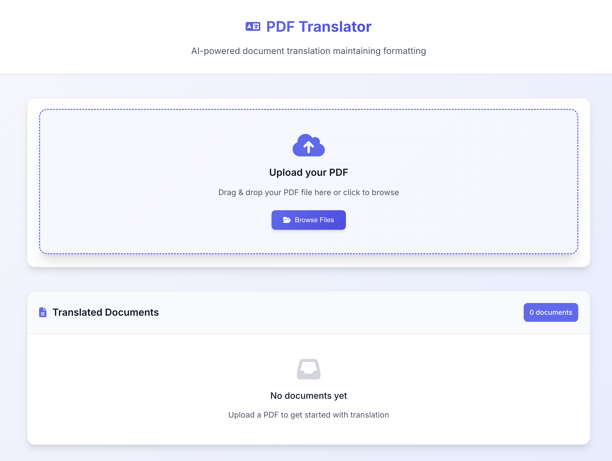

# PDF Translation Agent

A production-ready web application that translates PDF documents using Google's Gemini AI. The application extracts text from PDFs, translates it to English while preserving formatting, and provides multiple download formats.



## Features

- **PDF Upload & Translation**: Upload PDF files and get AI-powered translations
- **Format Preservation**: Maintains original document structure and formatting
- **Multiple Export Formats**: Download as Markdown, TXT, DOCX, or PDF
- **Real-time Progress**: Live progress tracking during translation
- **Web Preview**: View translated documents in the browser
- **Cost Tracking**: Real-time Google Gemini API cost monitoring with detailed breakdowns
- **Original PDF Access**: View and download original uploaded PDF files
- **Concurrent Processing**: Efficient multi-threaded translation pipeline
- **Production Ready**: Dockerized with proper logging and health checks

## Technology Stack

- **Backend**: Flask (Python)
- **AI Translation**: Google Gemini 2.5 Pro
- **PDF Processing**: PyMuPDF, Pillow
- **Document Generation**: WeasyPrint, python-docx
- **Frontend**: Vanilla JavaScript, CSS3
- **Deployment**: Docker, Docker Compose

## Quick Start

### Prerequisites

- Docker and Docker Compose installed
- Google Gemini API key ([Get one here](https://makersuite.google.com/app/apikey))

### Installation

1. **Clone the repository**
   ```bash
   git clone https://github.com/lklic/gemeni-large-pdf-translator.git
   cd translation-agent
   ```

2. **Set up environment variables**
   ```bash
   cp .env.sample .env
   # Edit .env and add your Google API key
   nano .env
   ```

3. **Build and run with Docker**
   ```bash
   docker-compose up --build
   ```

4. **Access the application**
   - Open your browser to `http://localhost:5001`
   - Upload a PDF file and start translating!

## Configuration

### Environment Variables

Create a `.env` file with the following variables:

```env
# Required: Google Gemini API Key
GOOGLE_API_KEY=your_google_gemini_api_key_here

# Optional: Flask environment
FLASK_ENV=production
```

### File Limits

- **Maximum file size**: 50MB
- **Supported formats**: PDF only
- **Concurrent translations**: Up to 8 pages simultaneously

## Cost Tracking

The application includes comprehensive cost tracking for Google Gemini API usage, providing real-time monitoring and detailed breakdowns of translation costs.

### Features

- **Real-time Cost Calculation**: Tracks input/output tokens for every API call
- **Tier-based Pricing**: Automatically applies Google's pricing tiers based on token usage
- **Operation Breakdown**: Separate cost tracking for transcription vs translation operations
- **Per-document Analysis**: Individual cost summaries saved with each translation
- **Web Interface Display**: Cost information visible in the file management interface

### Pricing Structure

The system uses Google Gemini's official pricing tiers:

**Input Tokens:**
- ≤200k tokens: $1.25 per 1M tokens
- >200k tokens: $2.50 per 1M tokens

**Output Tokens:**
- ≤200k tokens: $10.00 per 1M tokens
- >200k tokens: $15.00 per 1M tokens

### Cost Data Storage

For each translated document, cost information is stored in:
- `cost_summary.json` - Summary with total costs and breakdowns
- `cost_log.json` - Detailed log of individual API calls

### Accessing Cost Information

**Web Interface:**
- View total cost for each document in the file list
- Click "Cost" button for detailed breakdown including:
  - Total cost and token usage
  - Operation-specific costs (transcription vs translation)
  - Average cost per API call
  - Pricing tier information

**API Endpoint:**
- `GET /cost/<dirname>` - Returns JSON cost data for a document

## Usage

### Web Interface

1. **Upload**: Drag and drop or browse for PDF files
2. **Monitor**: Watch real-time translation progress
3. **Preview**: View translated content in the web interface
4. **Cost Analysis**: View real-time costs and detailed breakdowns for each document
5. **Original Access**: View and download original PDF files
6. **Download**: Export in multiple formats (MD, TXT, DOCX, PDF)
7. **Manage**: Delete completed translations

### API Endpoints

- `GET /` - Web interface
- `POST /upload` - Upload PDF file
- `GET /progress/<filename>` - Check translation progress
- `GET /files` - List all translated documents
- `GET /view/<dirname>` - View translated content
- `GET /download/<dirname>/<format>` - Download in specified format
- `GET /cost/<dirname>` - Get cost information for translated document
- `GET /original/<dirname>` - View/download original PDF file
- `POST /delete/<dirname>` - Delete translation
- `GET /health` - Health check endpoint

## Docker Commands

### Development

```bash
# Build and run
docker-compose up --build

# Run in background
docker-compose up -d

# View logs
docker-compose logs -f

# Rebuild after code changes
docker-compose build
docker-compose up
```

### Production

```bash
# Run in production mode
docker-compose up -d

# Check container status
docker-compose ps

# View application logs
docker-compose logs translation-agent

# Update application
git pull
docker-compose build
docker-compose up -d
```

## Data Management

### Volumes

- **Translation Data**: `./data` - Stores all uploaded PDFs and translations
- **Application Logs**: Docker volume `translation_logs` - Application logs

### Accessing Data

```bash
# View translation files
ls -la ./data/

# Access logs
docker-compose logs translation-agent

# Copy files from container
docker cp translation-agent:/app/logs ./local-logs
```

### Backup

```bash
# Backup translation data
tar -czf translations-backup-$(date +%Y%m%d).tar.gz ./data/

# Backup logs
docker run --rm -v translation_logs:/logs -v $(pwd):/backup alpine tar -czf /backup/logs-backup-$(date +%Y%m%d).tar.gz -C /logs .
```

## Architecture

### Translation Pipeline

1. **Stage 1: Transcription**
   - Extract images from PDF pages
   - Use Gemini Vision to transcribe to Markdown
   - Preserve formatting and structure
   - Track API costs for transcription operations

2. **Stage 2: Translation**
   - Translate transcribed text to English
   - Maintain Markdown formatting
   - Preserve academic terminology
   - Track API costs for translation operations

3. **Stage 3: Compilation**
   - Combine all translated pages
   - Add page delimiters
   - Generate final document
   - Save cost summary and detailed logs

### Cost Tracking Pipeline

1. **Token Extraction**
   - Parse Gemini API responses for usage metadata
   - Extract input and output token counts
   - Handle different response formats

2. **Cost Calculation**
   - Apply tier-based pricing based on cumulative token usage
   - Calculate costs per API call and operation type
   - Maintain running totals with thread-safe operations

3. **Data Persistence**
   - Log individual API calls with timestamps and costs
   - Generate comprehensive cost summaries
   - Store data in JSON format alongside translations

### File Structure

```
translation-agent/
├── app.py                 # Flask application
├── translate.py           # Translation pipeline
├── cost_tracker.py        # Cost tracking system
├── requirements.txt       # Python dependencies
├── Dockerfile            # Container definition
├── docker-compose.yml    # Docker orchestration
├── static/               # Frontend assets
│   ├── css/style.css
│   └── js/main.js
├── templates/            # HTML templates
│   └── index.html
└── data/                 # Translation data (volume)
    └── <document-name>/
        ├── <original-filename>.pdf  # Original uploaded PDF
        ├── cost_summary.json        # Cost summary and breakdown
        ├── cost_log.json           # Detailed API call logs
        ├── transcription/          # Page transcription files
        ├── translation/            # Page translation files
        └── translated.md           # Final translated document
```

## Troubleshooting

### Common Issues

**Container won't start**
```bash
# Check logs
docker-compose logs

# Rebuild container
docker-compose build --no-cache
```

**Translation fails**
```bash
# Check API key
cat .env

# View detailed logs
docker-compose logs translation-agent
```

### Health Checks

```bash
# Check application health
curl http://localhost:5000/health

# Check container health
docker-compose ps
```

## Security Considerations

- API keys are stored in environment variables
- Container runs as non-root user
- File uploads are validated and sanitized
- No sensitive data in logs
- Designed for deployment behind reverse proxy


## License

This project is licensed under the MIT License.

---

**Note**: This application is designed to run behind Cloudflare with Google Authentication. No internal authentication is implemented.
