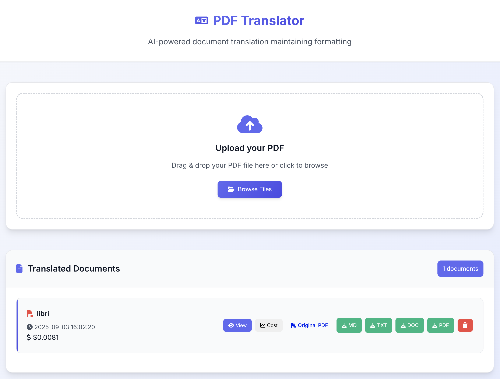

# PDF Translation Agent

A production-ready web application that translates PDF documents using Google's Gemini AI. The application extracts text from PDFs, translates it to English while preserving formatting, and provides multiple download formats.



## Features

- **PDF Upload & Translation**: Upload PDF files and get AI-powered translations
- **Format Preservation**: Maintains original document structure and formatting
- **Multiple Export Formats**: Download as Markdown, TXT, DOCX, or PDF
- **Real-time Progress**: Live progress tracking during translation
- **Web Preview**: View translated documents in the browser
- **Concurrent Processing**: Efficient multi-threaded translation pipeline
- **Production Ready**: Dockerized with proper logging and health checks

## Technology Stack

- **Backend**: Flask (Python)
- **AI Translation**: Google Gemini 2.5 Pro
- **PDF Processing**: PyMuPDF, Pillow
- **Document Generation**: WeasyPrint, python-docx
- **Frontend**: Vanilla JavaScript, CSS3
- **Deployment**: Docker, Docker Compose

## Quick Start

### Prerequisites

- Docker and Docker Compose installed
- Google Gemini API key ([Get one here](https://makersuite.google.com/app/apikey))

### Installation

1. **Clone the repository**
   ```bash
   git clone https://github.com/lklic/gemeni-large-pdf-translator.git
   cd translation-agent
   ```

2. **Set up environment variables**
   ```bash
   cp .env.sample .env
   # Edit .env and add your Google API key
   nano .env
   ```

3. **Build and run with Docker**
   ```bash
   docker-compose up --build
   ```

4. **Access the application**
   - Open your browser to `http://localhost:5001`
   - Upload a PDF file and start translating!

## Configuration

### Environment Variables

Create a `.env` file with the following variables:

```env
# Required: Google Gemini API Key
GOOGLE_API_KEY=your_google_gemini_api_key_here

# Optional: Flask environment
FLASK_ENV=production
```

### File Limits

- **Maximum file size**: 50MB
- **Supported formats**: PDF only
- **Concurrent translations**: Up to 8 pages simultaneously

## Usage

### Web Interface

1. **Upload**: Drag and drop or browse for PDF files
2. **Monitor**: Watch real-time translation progress
3. **Preview**: View translated content in the web interface
4. **Download**: Export in multiple formats (MD, TXT, DOCX, PDF)
5. **Manage**: Delete completed translations

### API Endpoints

- `GET /` - Web interface
- `POST /upload` - Upload PDF file
- `GET /progress/<filename>` - Check translation progress
- `GET /files` - List all translated documents
- `GET /view/<dirname>` - View translated content
- `GET /download/<dirname>/<format>` - Download in specified format
- `POST /delete/<dirname>` - Delete translation
- `GET /health` - Health check endpoint

## Docker Commands

### Development

```bash
# Build and run
docker-compose up --build

# Run in background
docker-compose up -d

# View logs
docker-compose logs -f

# Rebuild after code changes
docker-compose build
docker-compose up
```

### Production

```bash
# Run in production mode
docker-compose up -d

# Check container status
docker-compose ps

# View application logs
docker-compose logs translation-agent

# Update application
git pull
docker-compose build
docker-compose up -d
```

## Data Management

### Volumes

- **Translation Data**: `./data` - Stores all uploaded PDFs and translations
- **Application Logs**: Docker volume `translation_logs` - Application logs

### Accessing Data

```bash
# View translation files
ls -la ./data/

# Access logs
docker-compose logs translation-agent

# Copy files from container
docker cp translation-agent:/app/logs ./local-logs
```

### Backup

```bash
# Backup translation data
tar -czf translations-backup-$(date +%Y%m%d).tar.gz ./data/

# Backup logs
docker run --rm -v translation_logs:/logs -v $(pwd):/backup alpine tar -czf /backup/logs-backup-$(date +%Y%m%d).tar.gz -C /logs .
```

## Architecture

### Translation Pipeline

1. **Stage 1: Transcription**
   - Extract images from PDF pages
   - Use Gemini Vision to transcribe to Markdown
   - Preserve formatting and structure

2. **Stage 2: Translation**
   - Translate transcribed text to English
   - Maintain Markdown formatting
   - Preserve academic terminology

3. **Stage 3: Compilation**
   - Combine all translated pages
   - Add page delimiters
   - Generate final document

### File Structure

```
translation-agent/
├── app.py                 # Flask application
├── translate.py           # Translation pipeline
├── requirements.txt       # Python dependencies
├── Dockerfile            # Container definition
├── docker-compose.yml    # Docker orchestration
├── static/               # Frontend assets
│   ├── css/style.css
│   └── js/main.js
├── templates/            # HTML templates
│   └── index.html
└── data/                 # Translation data (volume)
    └── <document-name>/
        ├── original.pdf
        ├── transcription/
        ├── translation/
        └── translated.md
```

## Troubleshooting

### Common Issues

**Container won't start**
```bash
# Check logs
docker-compose logs

# Rebuild container
docker-compose build --no-cache
```

**Translation fails**
```bash
# Check API key
cat .env

# View detailed logs
docker-compose logs translation-agent
```

### Health Checks

```bash
# Check application health
curl http://localhost:5000/health

# Check container health
docker-compose ps
```

## Security Considerations

- API keys are stored in environment variables
- Container runs as non-root user
- File uploads are validated and sanitized
- No sensitive data in logs
- Designed for deployment behind reverse proxy


## License

This project is licensed under the MIT License.

---

**Note**: This application is designed to run behind Cloudflare with Google Authentication. No internal authentication is implemented.
